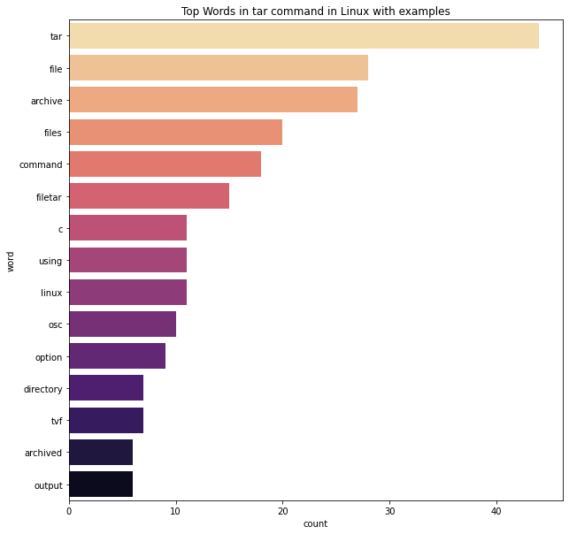

# Big_Data_Project__PySpark
Author: Guan Ming Chee </br>
Language: Python </br>
Tools: Pyspark, Databricks Notebook, MatPlotLib, Seaborn, Regex </br>
Data: **tar command in Linux with examples** (see resources section) </br>
Task: Count words and spot frequently used words in a text data. </br>

- Insert data
```
import urllib.request

urllib.request.urlretrieve("https://raw.githubusercontent.com/GuanMingChee/Big_Data_Project__PySpark/main/linux_tarCommand.txt" , "/tmp/linux.txt")
```

- Ingest Data into DBFS
```
dbutils.fs.mv("file:/tmp/linux.txt","dbfs:/data/linux.txt")
```
- Create an initial RDD using Spark Context
```
linuxRDD = sc.textFile("dbfs:/data/linux.txt")
```
- Flatmap to word tokens
```
wordsRDD=linuxRDD.flatMap(lambda line : line.lower().strip().split(" "))
```
- Filter out stopwords
```
import re
# remove punction
cleanTokensRDD = wordsRDD.map(lambda w: re.sub(r'[^a-zA-Z]','',w))
#remove stopwords
from pyspark.ml.feature import StopWordsRemover
remover =StopWordsRemover()
stopwords = remover.getStopWords()
cleanwordRDD=cleanTokensRDD.filter(lambda w: w not in stopwords)
cleanword_nospaceRDD = cleanwordRDD.filter(lambda x: x != "")
```
- Map to intermediate key, value pairs
```
IKVPairsRDD= cleanword_nospaceRDD.map(lambda word: (word,1))
```
- Reduce by Key to get your counts
```
wordCountRDD = IKVPairsRDD.reduceByKey(lambda acc, value: acc+value)
```
- Collect back into native Python for charting. 
```
results = wordCountRDD.collect()
```
- Sort in reverse order
```
output = sorted(results, key=lambda t: t[1], reverse=True)[:15]
```
- Charting
```
import numpy as np
import pandas as pd
import matplotlib.pyplot as plt
import seaborn as sns
from collections import Counter
source = 'tar command in Linux with examples'
title = 'Top Words in ' + source
xlabel = 'word'
ylabel = 'count'
df = pd.DataFrame.from_records(output, columns =[xlabel, ylabel]) 
plt.figure(figsize=(10,10))
sns.barplot(ylabel, xlabel, data=df, palette="magma_r").set_title(title)
```


## Resources
- Original text: 
  https://www.geeksforgeeks.org/tar-command-linux-examples/
